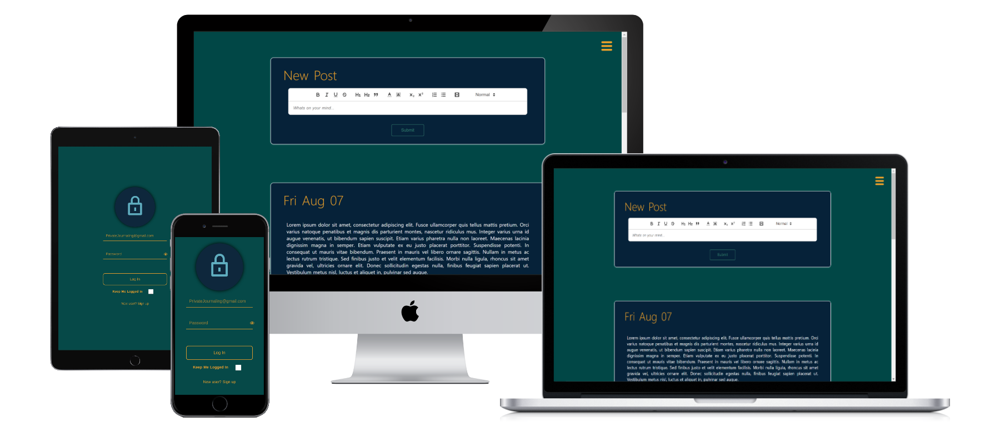

# Private-Journal

Private Journal is an online journaling app that provides users a secure way to keep their thoughts private. Private Journal utilizes encrypted database entries to ensure users data is secure and visible only to them.

Start a Journal: To get started, users must create an account. This requires an email and password. Users can use a fake email if they'd like, we do not ask for email verification so feel free to treat this like more like a username. After doing so your personal, private journal is created and you can start recording your thoughts securely!

Created using HTML/CSS/JavaScript, Vue, Nuxt, Firebase, and Quill

[privatejournal.herokuapp.com](https://privatejournal.herokuapp.com/)
